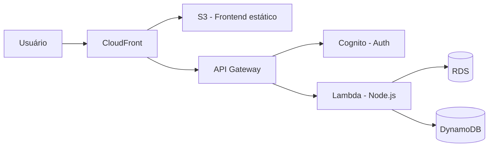

# 🛠️ Bancada

> Uma bancada de testes na AWS para provar, na prática, o que separa um SRE Specialist de um Staff / Platform Engineer.


---

## Sobre o projeto

O **Bancada** nasceu com o nome *Forge* e foi rebatizado para ter identidade própria. É uma plataforma pessoal de prática em AWS: um espaço onde cada estudo, POC e MVP vira código de verdade, rodando em produção na nuvem — em vez de ficar só em anotações ou cursos.

A ideia por trás é simples: sair do nível de **SRE Specialist** e chegar em **Staff Engineer / Platform Engineer** exige profundidade que só se constrói *construindo*. O Bancada é onde esse conhecimento é testado, quebrado e reconstruído.

Toda a plataforma segue duas regras: **tecnicamente sólida** (sem atalhos superficiais) e **barata e escalável** (arquitetura serverless-first, custo sob controle).

## Arquitetura (fase atual — MVP serverless)



Toda a infraestrutura é provisionada via **Terraform**.

## Stack técnica

| Camada             | Tecnologia                          |
|---------------------|--------------------------------------|
| Frontend            | React + Vite + TypeScript            |
| Backend             | Node.js (AWS Lambda)                 |
| API                 | Amazon API Gateway                   |
| Autenticação        | Amazon Cognito                       |
| CDN / Static hosting| CloudFront + S3                      |
| Dados               | RDS / DynamoDB                       |
| Infraestrutura      | Terraform                            |
| Ambiente de dev     | Devbox + Dev Containers (VS Code)    |
| Observabilidade     | Datadog *(planejado)*                |

## Ambiente de desenvolvimento

O projeto usa [Devbox](https://www.jetify.com/devbox) + Dev Containers para garantir que todo mundo (inclusive o "eu do futuro") tenha exatamente as mesmas ferramentas, sem depender de instalação manual.

```bash
# 1. Clone o repositório
git clone <url-do-repo>
cd bancada

# 2. Abra no VS Code e reabra dentro do container
code .
# Ctrl+Shift+P > "Dev Containers: Reopen in Container"
```

O container já vem com Node.js, Terraform, Terragrunt, AWS CLI v2 e AWS SAM CLI instalados.

## Roadmap

- [x] **Fase 1 — MVP serverless**: CloudFront, Cognito, API Gateway, Lambda, S3, RDS/DynamoDB, Terraform
- [ ] **Fase 2 — Observabilidade**: métricas, logs estruturados e tracing distribuído
- [ ] **Fase 3 — Processamento orientado a eventos**: SQS, EventBridge, arquitetura assíncrona
- [ ] **Fase 4 — EKS**: migração de cargas selecionadas para Kubernetes
- [ ] **Fase 5 — Plataforma de dados**: pipelines de ingestão e transformação
- [ ] **Fase 6 — IA/ML**: integração de modelos e casos de uso inteligentes

## Status do projeto

🚧 Em desenvolvimento ativo — a Fase 1 está sendo construída.

## Licença

Distribuído sob a licença MIT. Veja `LICENSE` para mais detalhes.

## Autor

**Alberto S. Fernandes** — [LinkedIn](alberto-souza-fernandes) · [GitHub](albertosfernandes)